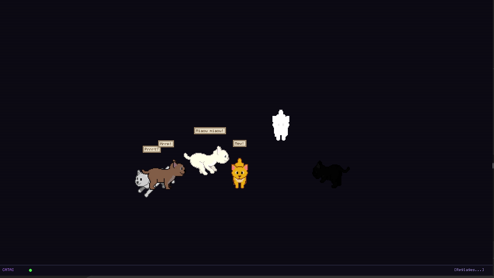
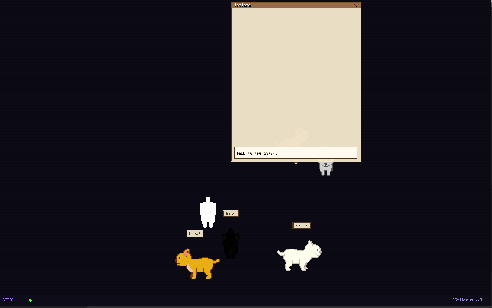

# CATAI Linux 🐱

**Pixel-art desktop cats that walk on your Linux desktop and talk to you using local LLMs (Ollama).**

A lightweight, single-file app that brings animated, interactive, AI-powered cats to your desktop.





▶️ Full video: [Watch demo](assets/demo.mp4)

Linux port of [wil-pe/CATAI](https://github.com/wil-pe/CATAI) — pixel art desktop cats, powered by Ollama LLM.

## Quickstart

```bash
# 1. Install dependencies
bash install.sh

# 2. (Optional) Install Ollama for AI chat
curl -fsSL https://ollama.ai/install.sh | sh
ollama serve &
ollama pull qwen2.5:3b

# 3. (Optional) Download high-quality sprites
python3 catai.py --download

# 4. Run!
python3 catai.py
```

Without Ollama, cats roam the desktop but stay silent. Without `--download`, procedurally generated sprites are used.

| Action | Control |
|--------|---------|
| Chat with a cat | Left click |
| Move a cat | Right click + drag |
| Settings | Ctrl+S |
| Quit | Ctrl+Q |

## Manual Installation (Fedora 43)

```bash
# System dependencies
sudo dnf install python3 python3-pip SDL2 SDL2_image SDL2_mixer SDL2_ttf

# Python dependencies
pip install pygame pillow requests --user

# Run
python3 catai.py
```

## Usage

| Action | Control |
|--------|---------|
| Open chat | Left click on a cat |
| Move cat | Right click + drag |
| Settings | Ctrl+S or [Settings] button at bottom right |
| Quit | Ctrl+Q |

## Options

```bash
# Spawn specific cats
python3 catai.py --cats orange black grey

# Choose Ollama model
python3 catai.py --model qwen2.5:3b

# Change sprite scale (1-6)
python3 catai.py --scale 4

# Fullscreen
python3 catai.py --fullscreen

# Download sprites from GitHub
python3 catai.py --download

# Opaque background (disable transparency)
python3 catai.py --opaque
```

## Cats and Personalities

| Color | Name FR | Name EN | Name ES | Personality |
|-------|---------|---------|---------|-------------|
| orange | Citrouille | Pumpkin | Calabaza | Playful & mischievous |
| black | Ombre | Shadow | Sombra | Mysterious & philosophical |
| white | Neige | Snow | Nieve | Elegant & poetic |
| grey | Einstein | Einstein | Einstein | Wise & scholarly |
| brown | Indiana | Indiana | Indiana | Adventurous storyteller |
| cream | Caramel | Caramel | Caramelo | Cuddly & comforting |

## Multilingual

The interface supports 3 languages: French, English, Spanish.
Switch language in Settings (Ctrl+S) by clicking [FR], [EN], or [ES].

Cat names, Ollama personalities, and meows adapt to the selected language.

## Ollama (required for AI chat)

```bash
# Install Ollama
curl -fsSL https://ollama.ai/install.sh | sh

# Start the server
ollama serve &

# Download a lightweight model (recommended)
ollama pull qwen2.5:3b
# or
ollama pull llama3.2:3b
```

Without Ollama, cats roam the desktop but stay silent.

## Custom Sprites

Place your PNGs in `./sprites/<color>/<state>/<direction>/frame_NNN.png`.

Supported states: `angry`, `drinking`, `eating`, `running-8-frames`, `waking-getting-up`
Directions: `east`, `north`, `north-east`, `north-west`, `south`, `south-east`, `south-west`, `west`
Rotations (idle/sleeping): `./sprites/<color>/rotations/<direction>.png`

Format: PNG 68x68 px with transparency (RGBA), named `frame_000.png` to `frame_NNN.png`.

The original CATAI macOS sprites (MIT) are compatible. Use `--download` to fetch them automatically.

Non-orange cats use an HSB tinting system to colorize orange sprites — no separate sprites needed for each color.

## Configuration Files

- `~/.catai_settings.json` — preferences (model, scale, active cats, language)
- `~/.catai_memory.json` — conversation history (per unique cat)

## Differences from CATAI macOS

| Feature | macOS | Linux |
|---------|-------|-------|
| Real PNG sprites | 368 sprites | via --download or ori/ |
| HSB tinting for colors | | |
| Ollama integration | | |
| Personalities | | |
| Conversation memory | 20 msgs | 20 msgs (~/.catai_memory.json) |
| Dock overlay | AppKit | borderless window (transparent on X11) |
| Native Wayland | N/A | via SDL2 (XWayland) |
| Random meow bubbles | | |
| Multilingual FR/EN/ES | | |
| Animation states | 6 states | 7 states (idle, walking, sleeping, eating, drinking, angry, waking) |
| 8 directions | | |
| Ollama model selection | dropdown | click to cycle |
| Cat name editing | | |
| Sprite download | manual | --download |

## Known Issues

- **No Wayland transparency** — Wayland compositors don't support X Shape click-through or transparent overlays. The app falls back to an opaque window with scanlines. This is a Wayland protocol limitation, not a bug.
- **No title-bar walking** — `get_active_window_geometry_x11()` is implemented but its result is never used. The macOS original perches cats on the frontmost window's title bar.
- **`_frame_count_cache` never invalidated** — if sprites are downloaded at runtime, stale "0 frame" entries persist until restart.
- **X11 display connection leak** — `_X11Conn.close()` is a no-op to avoid a Python 3.14+ segfault. One FD is leaked per session.

## Strengths

- **Single-file, zero-build deployment** — one Python file, no compilation, no package structure. Download and run.
- **Dual-mode rendering** — automatic detection of X11 vs Wayland with graceful fallback. Desktop mode gives true transparency on X11; window mode works everywhere.
- **HSB color tinting matches macOS original** — per-pixel hue shift, saturation multiply, and brightness offset produce exact color matches for non-orange cats without needing separate sprite sets. Vectorized with numpy for fast initial load.
- **Procedural fallback** — works immediately without any sprite download. The pixel-art generated cats are recognizable and animated.
- **Multilingual** — French, English, and Spanish UI with language-adaptive cat names, personalities, and meows.
- **Procedural sound** — no external WAV files needed. Meow, purr, and click sounds are generated from numpy waveforms at runtime.
- **Click vs. drag distinction** — 5px threshold matches macOS interaction model: left-click opens chat, left-drag moves the cat, right-click shows context menu.
- **X Shape click-through** — transparent areas of the overlay are genuinely click-through on X11, so cats don't block desktop interaction. Cached to only update when cats move.
- **8-directional walking** — cats walk toward random destinations using all 8 cardinal directions, matching the macOS original.

## Areas for Improvement

- **Split into modules** — the single file should be refactored into `cat.py`, `sprites.py`, `chat.py`, `settings.py`, `x11.py`, `sound.py`, etc.
- **Add unit tests** — HSB tinting math, state machine transitions, pixel font rendering, and memory persistence all need tests.
- **Invalidate frame count cache after sprite download** — clear `_frame_count_cache` when `--download` completes during a running session.

## Architectural Limitations

These issues require significant structural changes and cannot be fixed with small patches:

- **No Wayland transparency** — Wayland's security model prohibits client-side window transparency and input redirection. There is no protocol equivalent to X Shape extension. The only path forward would be a compositor-specific plugin (GNOME Shell extension, KWin effect), which is a separate project entirely.
- **No title-bar walking** — the macOS original uses `CGWindowListCopyWindowInfo` to detect window frames and perch cats on title bars. On Linux, `get_active_window_geometry_x11()` can retrieve window positions via xdotool/python-xlib, but using those coordinates to position cats on top of other windows requires either: (a) a compositor overlay that can draw between window layers (X11 only, fragile), or (b) a separate transparent window per cat synced to the active window's position (major refactor of the rendering model).
- **X11 display connection leak** — calling `XCloseDisplay` via ctypes triggers a segfault on Python 3.14+ due to internal thread-state cleanup. The only workaround is the current no-op close. A proper fix requires either migrating all X11 calls to python-xlib (which handles connection lifecycle correctly) or restructuring the ctypes bindings to avoid the crash — both are substantial rewrites of the transparency layer.
- **Single-file architecture blocks testability** — the 3000-line monolith makes it impractical to import and unit-test individual components (HSB math, state machine, sprite loading) in isolation. Adding proper tests requires splitting into modules first, which changes the project's zero-file-install deployment model.
- **Per-frame X Shape rendering model** — the current architecture renders the entire screen as a single transparent overlay and applies an alpha mask. This means every pixel of every cat must be composited into a full-screen surface, then packed into a 1-bit X Shape mask. A proper fix would use separate small windows per cat (like the macOS `NSWindow`-per-cat approach), eliminating both the full-screen surface and the per-frame mask update — but this is a fundamental redesign of the window management layer.

## Credits

This project is a Linux port of [CATAI](https://github.com/wil-pe/CATAI) by **wil-pe**.

Code and assets reused from the original project (MIT):
- **Pixel art sprites** — 368 orange cat sprites (`cute_orange_cat/`) drawn by wil-pe, used via `--download` or copied from `ori/CATAI/`
- **HSB tinting logic** — The `tintSprite()` colorization algorithm from wil-pe/CATAI's `cat.swift` was rewritten in Python to produce black, white, grey, brown, and cream variants from orange sprites
- **Cat personalities and names** — Citrouille, Ombre, Neige, Einstein, Indiana, Caramel and their Ollama prompts are adapted from the original project
- **Animation structure** — States (idle, walking, sleeping, eating, drinking, angry, waking) and 8 directions follow CATAI macOS's animation system

## License

This project is distributed under the **GNU General Public License v3** (GPLv3).

Derivative elements from the original [wil-pe/CATAI](https://github.com/wil-pe/CATAI) project remain under their original **MIT** license. The `LICENSE` file contains the full text of both licenses.
